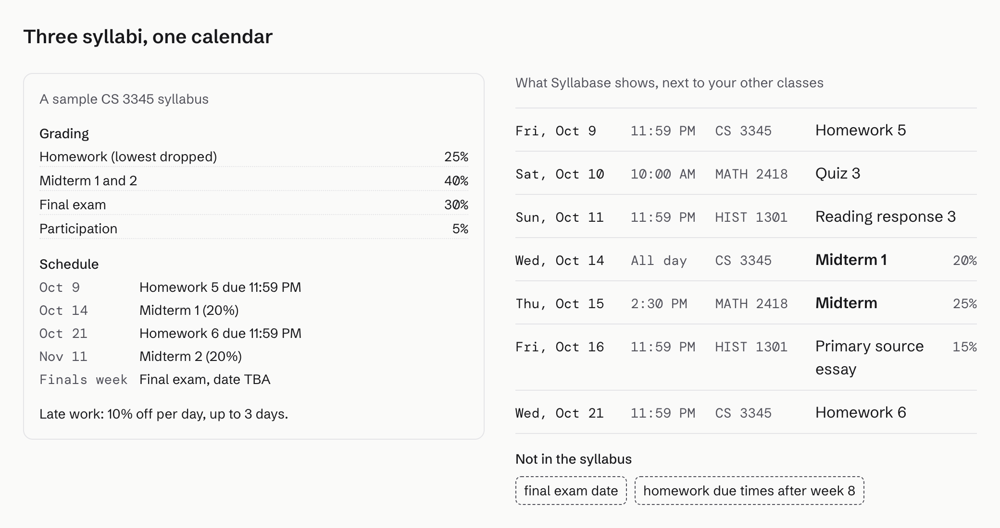
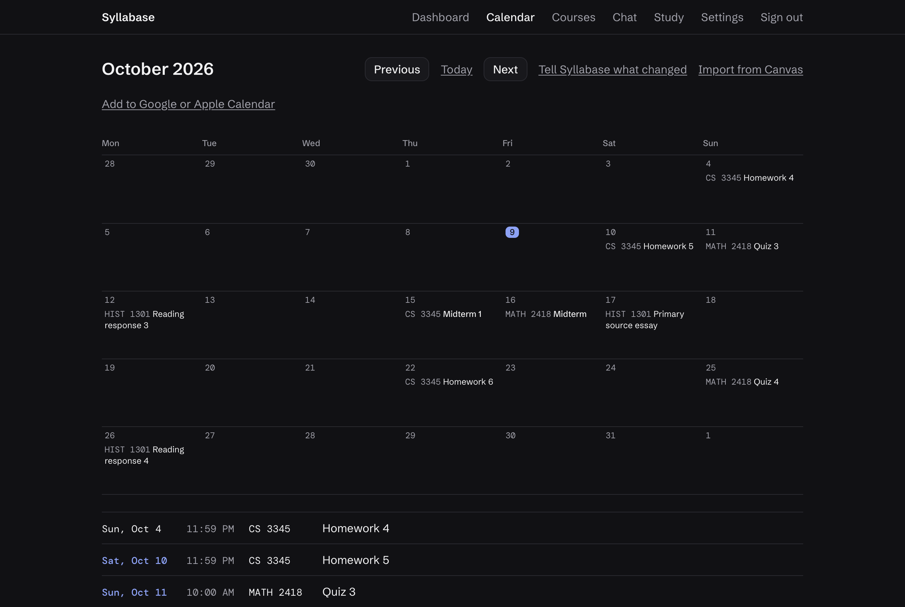
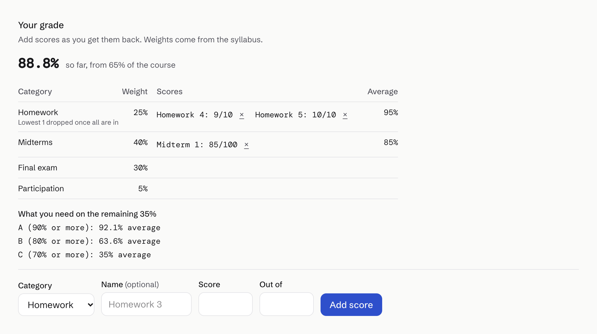
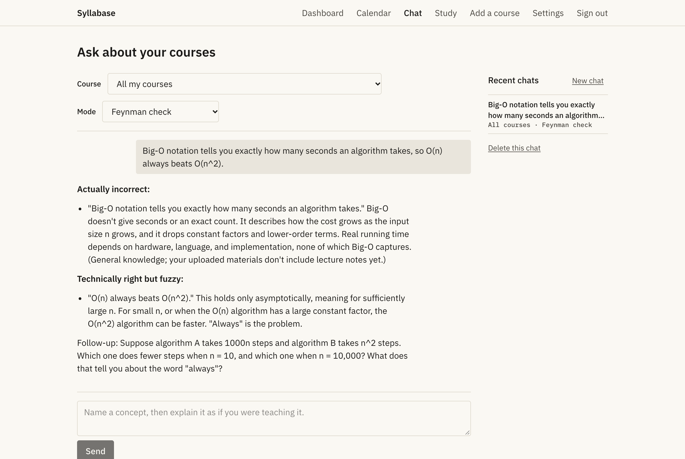
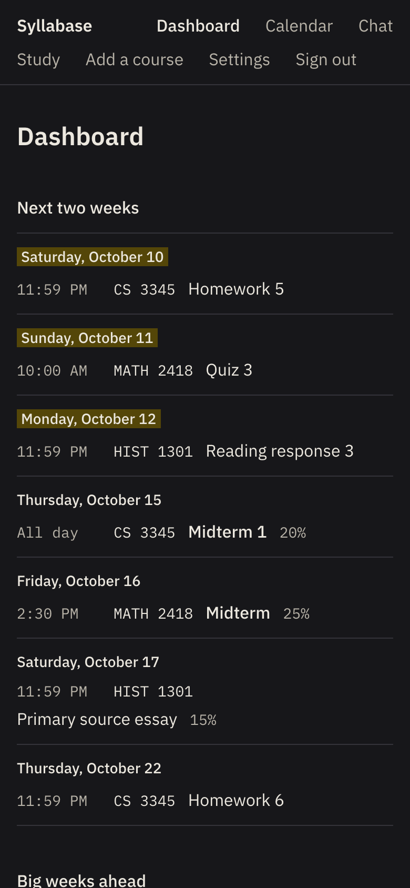

# Syllabase

[](https://github.com/roscoe02/Syllabase/actions/workflows/ci.yml)

Upload your syllabi and get one calendar with every exam, due date and grade weight. Connect your Canvas calendar, ask
questions about your classes, study with tools that run on your own notes, and see what you need on the final.

**Live demo:** [syllabase-app.vercel.app](https://syllabase-app.vercel.app). Click "Try it as a guest" to explore three
sample courses, no sign-up needed.



## What it does

- **Syllabus to calendar.** Claude reads each PDF syllabus and pulls out the grading breakdown, graded items, dates and
  policies. You review everything before it's saved, and anything the syllabus leaves out is shown as missing instead of guessed.
- **Canvas sync.** Paste your Canvas calendar feed link. New assignments appear on their own, and ones that match a
  syllabus item (same course, number and similar name) replace it instead of showing up twice.
- **Chat that knows your classes.** Ask "when is my next exam and how much is it worth?" and get an answer from your
  syllabi and calendar. Study modes turn the chat into a Feynman check, a finals coach, lecture recovery and more.
- **Quick add.** Tell the chat what changed ("Midterm 2 moved to Nov 19", "quiz every Friday at 10 starting Oct 16")
  and it proposes calendar changes. Nothing is saved until you confirm.
- **Study tools.** Cheat sheets, flashcards, practice quizzes, concept maps and an exam predictor built from the notes,
  slides and past exams you upload.
- **Grade calculator.** Enter scores as you get them back and see your current grade and what you need on the rest of the
  course for an A, B or C, with drop-lowest rules applied.
- **UT Dallas grades and professors.** Each UTD course page shows how past sections were graded, the same for your
  professor's own sections, their Rate My Professors summary, and a link to UTD Trends.
- **Calendar export.** Subscribe from Google, Apple or Outlook Calendar and new deadlines show up there too.

| Calendar (dark mode) | Grade calculator |
| --- | --- |
|  |  |

| Study mode in chat | Phone |
| --- | --- |
|  |  |

## How it works

- **Next.js 16** (App Router, Cache Components) with TypeScript and Tailwind v4.
- **Supabase** for Postgres, auth (email links and anonymous guest accounts, with optional Google sign-in) and file storage. Every table has
  row-level security, and `npm run test:db` checks it across two users on an in-memory Postgres.
- **Claude Haiku 5.5** through the Anthropic SDK. Syllabus extraction uses structured outputs validated with Zod; chat and
  study tools stream their replies. Course materials are sent as reference documents with prompt caching, kept apart
  from the instructions.
- **Limits** on every AI route: per-user rate limits (Upstash), daily token budgets per user and for the whole site, and
  smaller budgets for guests.
- **Calendar feeds** are fetched through an SSRF-safe fetcher, and saved feed links are encrypted at rest. `node-ical`
  parses them and `ical-generator` builds the export feed.
- **Vercel** hosts the app and runs two daily cron jobs: refreshing calendar feeds and deleting guest accounts after 7 days.

## Run it locally

You need Node.js 20.9 or newer, a Supabase project and an Anthropic API key.

```bash
npm install
cp .env.example .env.local
npm run dev
```

Fill in `.env.local` (each variable is described in `.env.example`), then apply the SQL files in `supabase/migrations/`
to your Supabase project in order.

| Command | What it does |
| --- | --- |
| `npm run dev` | Dev server at http://localhost:3000 |
| `npm test` | Unit tests (Vitest) |
| `npm run test:db` | Applies the migrations to an in-memory Postgres and tests row-level security |
| `npm run lint` | ESLint |
| `npx next typegen && npx tsc --noEmit` | Type check |

## Credits

Made with [Claude](https://claude.ai). Set in [IBM Plex](https://github.com/IBM/plex) (SIL Open Font License).
UTD grade distributions from [acmutd/utd-grades](https://github.com/acmutd/utd-grades) (MIT; Texas public records).
Professor ratings from [Rate My Professors](https://www.ratemyprofessors.com/), shown as summaries with a link to the profile.
Course links go to [UTD Trends](https://trends.utdnebula.com/) by Nebula Labs.
Syllabase is an independent student project, not affiliated with The University of Texas at Dallas.

## License

[MIT](LICENSE)
